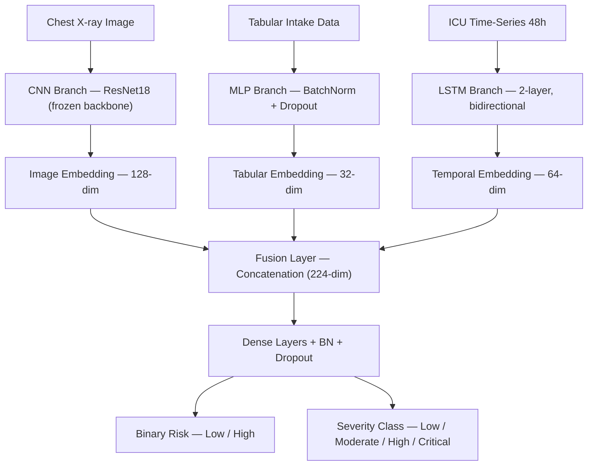

# Multimodal Healthcare Diagnostic & Patient Risk Prediction System

> **⚠️ DISCLAIMER**: This is an **academic/research prototype only**. It is **NOT** a medical diagnosis tool and is **NOT** intended for clinical deployment. The three datasets used (chest X-rays, diabetes tabular data, and ICU time-series vitals) come from **different patient populations** and are fused using simulated aligned batches for architectural demonstration purposes only.

---

## Overview

An end-to-end deep learning system that fuses **three clinical data modalities** — chest radiographs, structured patient intake data, and ICU time-series vitals — into a unified multimodal risk prediction. The system features independently trainable neural network branches, a late-fusion architecture, a FastAPI inference backend, a React dashboard frontend, and Supabase-backed patient record persistence.

## Architecture



### Training Strategy

| Component | Optimizer | Scheduler | Regularization |
|-----------|-----------|-----------|----------------|
| CNN Branch | AdamW (lr=1e-4, wd=1e-3) | CosineAnnealingWarmRestarts (T₀=5, T_mult=2) | Label smoothing (0.1), Gradient clip (5.0), Frozen backbone |
| Tabular Branch | AdamW (lr=5e-4, wd=1e-4) | CosineAnnealingLR | Class-weighted CrossEntropy, BatchNorm |
| RNN Branch | AdamW (lr=5e-4, wd=1e-3) | CosineAnnealingLR | Class-weighted loss, Gradient clip (0.5) |
| Fusion Head | AdamW (lr=5e-4, wd=1e-3) | CosineAnnealingLR | Frozen branches, Dual-head loss (0.7 binary + 0.3 severity) |

## Project Structure

```
multimodal-healthcare/
├── configs/
│   └── config.yaml                    # Central hyperparameters & dataset paths
├── src/
│   ├── data/
│   │   ├── preprocess_xray.py         # X-ray data loading & augmentation pipeline
│   │   ├── preprocess_tabular.py      # Diabetes tabular preprocessing & scaling
│   │   └── preprocess_timeseries.py   # PhysioNet ICU time-series parsing (48h × 12 vitals)
│   ├── models/
│   │   ├── cnn_branch.py             # ResNet18 + custom head (128-dim embedding)
│   │   ├── tabular_branch.py         # 3-layer MLP with BatchNorm (32-dim embedding)
│   │   ├── rnn_branch.py             # 2-layer LSTM (64-dim embedding)
│   │   └── fusion_model.py           # Multimodal fusion: concat → dense → binary + severity heads
│   ├── training/
│   │   ├── train_cnn.py              # CNN training with cosine warm restarts
│   │   ├── train_tabular.py          # Tabular training with class weights
│   │   ├── train_rnn.py              # LSTM training on full patient cohort
│   │   └── train_fusion.py           # Fusion head training with frozen branches
│   ├── evaluation/
│   │   ├── metrics.py                # Classification metrics, confusion matrices, ROC curves
│   │   ├── explainability.py         # Grad-CAM, SHAP, temporal importance
│   │   └── run_evaluation.py         # Full evaluation pipeline for all 4 models
│   └── api/
│       └── main.py                   # FastAPI server with 6 endpoints + CORS
├── frontend/
│   ├── src/
│   │   ├── App.tsx                   # Full dashboard UI (3-column layout)
│   │   ├── lib/
│   │   │   └── supabase.ts           # Supabase client & patient record persistence
│   │   ├── main.tsx                  # React entry point
│   │   └── index.css                 # Tailwind + custom styles
│   ├── .env                          # Supabase credentials (VITE_SUPABASE_*)
│   ├── package.json
│   ├── vite.config.ts
│   ├── tailwind.config.js
│   └── tsconfig.json
├── outputs/
│   ├── checkpoints/                  # Trained model weights (.pth)
│   ├── reports/                      # Classification reports (.txt)
│   └── plots/                        # Confusion matrices & ROC curves (.png)
├── supabase_schema.sql               # Database schema for patient_records table
├── requirements.txt                  # Python dependencies
└── README.md
```

## Tech Stack

| Layer | Technology |
|-------|-----------|
| **Deep Learning** | PyTorch 2.9, torchvision, scikit-learn |
| **Backend API** | FastAPI, Uvicorn, Pydantic |
| **Frontend** | React 19, TypeScript 5.7, Vite 6, Tailwind CSS 3 |
| **Database** | Supabase (PostgreSQL) with Row Level Security |
| **Explainability** | Grad-CAM (pytorch-grad-cam), SHAP, Matplotlib, Seaborn |

## Datasets

| Dataset | Modality | Samples | Task | Link |
|---------|----------|---------|------|------|
| Chest X-Ray Images (Pneumonia) | Images (224×224) | 5,856 | Binary: Normal vs Pneumonia | [Kaggle](https://www.kaggle.com/datasets/paultimothymooney/chest-xray-pneumonia) |
| Pima Indians Diabetes | Tabular (8 features) | 768 | Binary: No Diabetes vs Diabetes | [Kaggle](https://www.kaggle.com/datasets/uciml/pima-indians-diabetes-database) |
| PhysioNet Challenge 2012 (Set-A) | Time-series (48h × 12 vitals) | 4,000 patients | Binary: Survived vs Deceased | [PhysioNet](https://physionet.org/content/challenge-2012/1.0.0/) |

### Dataset Placement

```
../datasets/
├── ChestXRay2017/chest_xray/         # train/ and test/ subdirectories
├── diabetes.csv                       # Tabular diabetes data
├── set-a/set-a/                       # PhysioNet ICU patient records (.txt)
└── Outcomes-a.txt                     # ICU mortality outcome labels
```

## Setup & Installation

### 1. Prerequisites
- **Python 3.10+**
- **Node.js 18+** (for the frontend)
- CUDA-capable GPU recommended (falls back to CPU automatically)

### 2. Backend Setup

```bash
cd multimodal-healthcare
pip install -r requirements.txt
```

### 3. Frontend Setup

```bash
cd frontend
npm install
```

### 4. Supabase Setup (optional — for patient record persistence)

1. Create a project at [supabase.com](https://supabase.com)
2. Navigate to **SQL Editor** in the Supabase dashboard
3. Paste and run the contents of `supabase_schema.sql`
4. Copy your **Project URL** and **anon public key** from Settings → API
5. Create `frontend/.env`:

```env
VITE_SUPABASE_URL=https://your-project.supabase.co
VITE_SUPABASE_ANON_KEY=your-anon-key-here
```

## Training

Train each branch independently (order does not matter), then train the fusion model which requires all three branch checkpoints:

```bash
# 1. CNN branch — Chest X-ray pneumonia classification (~50 min on CPU)
python -m src.training.train_cnn

# 2. Tabular branch — Diabetes risk classification (~2 min on CPU)
python -m src.training.train_tabular

# 3. RNN branch — ICU mortality prediction from 48h vitals (~10 min on CPU)
python -m src.training.train_rnn

# 4. Fusion model — Requires all 3 checkpoints above (~15 min on CPU)
python -m src.training.train_fusion
```

Checkpoints are saved to `outputs/checkpoints/` as `cnn_best.pth`, `tabular_best.pth`, `rnn_best.pth`, and `fusion_best.pth`.

### Run Evaluation

Generate classification reports, confusion matrices, and ROC curves for all models:

```bash
python -m src.evaluation.run_evaluation
```

Outputs are saved to `outputs/reports/` and `outputs/plots/`.

## Model Performance

| Model | Task | Test Accuracy | F1-Score | ROC-AUC |
|-------|------|:---:|:---:|:---:|
| **CNN** (ResNet18) | Chest X-ray Pneumonia | **88.94%** | 0.886 | 0.961 |
| **Tabular** (MLP) | Diabetes Risk | **75.97%** | 0.765 | 0.810 |
| **RNN** (LSTM) | ICU Mortality | **87.25%** | 0.825 | 0.839 |
| **Fusion** (Multimodal) | Combined Risk Prediction | **91.42%** | 0.914 | 0.961 |

## Running the Application

### Start the Backend API

```bash
python -m uvicorn src.api.main:app --host 0.0.0.0 --port 8000
```

The API loads all four model checkpoints on startup. Verify at `http://localhost:8000/health`.

### Start the Frontend Dashboard

```bash
cd frontend
npm run dev
```

Open `http://localhost:5173` in your browser.

### API Endpoints

| Method | Endpoint | Description |
|--------|----------|-------------|
| `GET` | `/health` | Health check & loaded model status |
| `POST` | `/predict/xray` | Upload chest X-ray → pneumonia prediction |
| `POST` | `/predict/tabular` | Submit tabular features → diabetes risk |
| `POST` | `/predict/timeseries` | Submit ICU vitals → mortality prediction |
| `POST` | `/predict/fusion` | Submit all modalities → fused multimodal prediction |
| `POST` | `/api/predict/tabular` | Hospital intake form → full patient assessment with clinical interpretation |

## Frontend Features

- **3-column clinical dashboard**: Hospital Intake Form, Prescription/ICU Record Upload (with document type selector), and X-ray Scan Upload
- **Document-aware processing**: ICU records trigger 48h timeseries vital extraction; regular prescriptions do not
- **Real-time predictions**: Live API calls to the FastAPI backend with confidence scores and clinical interpretations
- **Multimodal fusion inference**: Combines all three modalities for a unified patient risk assessment
- **Supabase persistence**: Auto-saves patient records to cloud PostgreSQL after assessment
- **Interactive vital signs monitor**: Dropdown-switchable 48-hour sparkline charts for 12 ICU vital parameters

## Explainability

- **Grad-CAM**: Gradient-weighted heatmap overlays on chest X-ray predictions showing regions of interest
- **SHAP**: Feature importance analysis for tabular diabetes predictions
- **Temporal Importance**: Per-timestep feature contribution analysis for ICU time-series predictions

## License

This project is for **academic and educational purposes only**. Not intended for clinical or commercial use.
